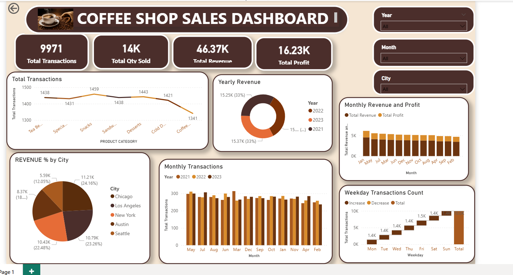

Coffee Shop Sales Dashboard – README
Project Name: Coffee Shop Sales Dashboard
Tool Used: Microsoft Power BI
Project Overview:
This Power BI dashboard analyzes coffee shop sales performance using interactive visualizations and KPI metrics. The dashboard helps track revenue, profit, transactions, product performance, city-wise sales, and monthly business trends.
Dashboard Features
•	Total Transactions, Quantity Sold, Revenue, and Profit KPIs
•	Yearly Revenue Analysis
•	Monthly Revenue and Profit Comparison
•	Revenue Distribution by City
•	Monthly Transactions Analysis
•	Weekday Transactions Count
•	Interactive Slicers for Year, City, and Month
Skills Used
•	Power BI Dashboard Design
•	Data Visualization
•	DAX Measures
•	Data Cleaning & Transformation
•	Business Analytics
Dashboard Screenshot

 
Conclusion
This project demonstrates how Power BI can be used to transform raw sales data into meaningful business insights through interactive dashboards and visual storytelling.
